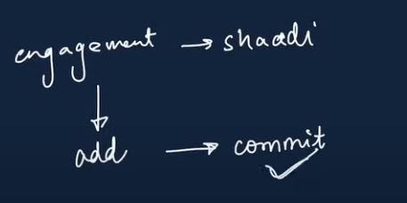
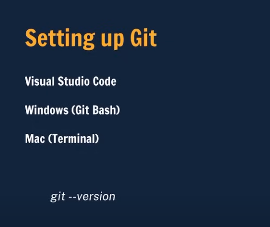
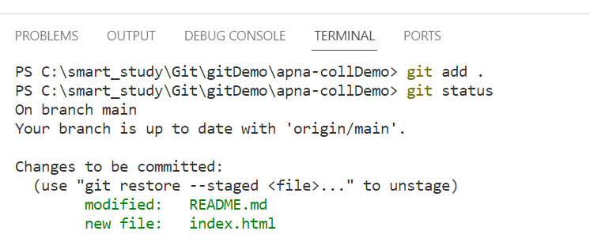
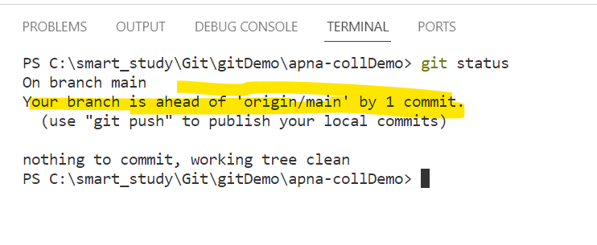
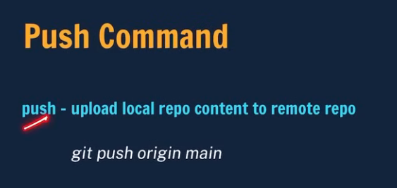
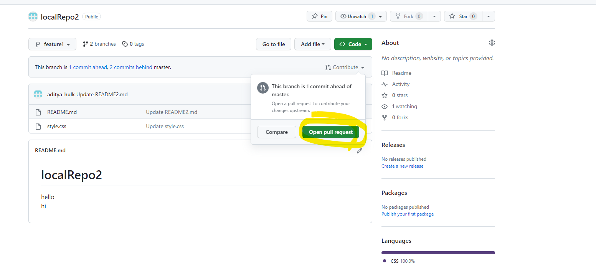

apne project ke code mein.. kab koyi file add hue, update hue delete hue.. sari info ye version control system track karte hai like Svn.

### Features
1) #### track the history
    
humne ek web page banaya.. uspe signup form fhir buttons banayai.. ab help page banane ke liye samay lag raha hia. hum chahte hai isse next phase mein design kare.. wapas signup button tak code chal jave.

ek to aap manually delete karo.. ya via git..

2) #### Collabaration  
konse changes konse devloper ne kiye..
 
--

# Github

yaha hum apna code folder(repository) k form me store kar sakte hia.

### Create account in github

### Create a project in github

### Commit code

git me add aur commit dono karna padta hai..

Github mein direct commit ho jata hai.

# Setup git

# Configuring git

hum git ko bata rahe hai..ki konse account ke andar changes karne jaa rahe hai

open git bash

### U can open terminal from vs code also

# Git Commands

2 tarh se clone  

# How to clone

git hub website se hum apne local machine me project lana chahte hai.

yadi folder mein enter karna ho  
  cd folder name + tab
  

### ls command
  

### to view hidden files
ls -a 

ls -Hidden   
yadi .git dikh raha hai.. toh ye github ki file hai

### git status

## now add and commit

## WE have 4 status in git

## Add particular file

## Add all

## Commit

  
matlab  
aapne abhi local commit kiya hai.. abhi github par nhi dikhaya de raha hai..

git push origin main -- not working

## Ab folder ko local se git hub par kaise pahuchaye

Make a local directory

cd LocalRepo cmd make enter to LocalRepo

## Make it git folder

Add commit

Now we have to push this in new repository
## Now upload this in github

Now create a new repo and push this in that repo

## remote ly push kiya

# Branch
  
alag log alag branch

  
aap main branch mein ho

## set branch new name

# short form

git push origin main

humne sare changes origin main mein push kar diye..
 humko ispar hi code changes karne hia

 git push -u origin main.. aage mein hu git push likhenge.. wo yahi push honge.

 

 
 This is workflow .. github mein repo bano  
 clone it  
   make changes  
   then add   
   then commit   
   then push

# Git Branches
### hum branch banate kyu hai?   
let say humari ek master branch hai. Aur hamare pass 3 developer hai.. aur har ek developer ko 1 feautre develope karna hai. So wo har feature ke liye nayi branch create kar lenga aur baad me master ke sath merge kar lenga.At a time sara kaam ho gya.

   

Now let's changes readme.md in feature1 branch.   
Ye jo bhi changes hai feature1 branch mein hue hai. 

# Now combine feaure1 and main branch

 
 

 

 # 2nd way Pull Request
 humne feature1 branch mein kuch naya data add kiya hai, aur usse PR ke through merge karwa rahe hai

 

 
 

 

 

 

 

 

 

 Abhi repository par main aur feature1 branch merge ho gya
 
 

 par jab mien apne local me check karta hu.. to local main branch mein to changes reflect nhi ho rahe hai

 

 Remote ke changes local mein lane k liye pull command

manlo remote branch mein kuch changes hue hai joh aapke local branch mein reflect nhi kar rahe hia.. so clone nhi karneka
pull karne ka.. sare changes reflect ho javenge  

git pull origin branch name

kiya hai implement succesfully

# Resolving Merge Conflicts

dono branch mien aapne same line of code change kiye hai aur jab aap merge karne jate.. to git ko samjh nhi aata konse file ke changes merge karne hai

# Undioing changes

# What happen in case of commit

last commit ka nam head hai, Head~1 mane ek step piche

# git log

write q to quit
# reset multiple commit

har commit ka hash hota hai.. yadi piche jana hai toh uska hash head ke sath likho

# Fork

naya project serch kiya

hamare isme aa gya

ab apne isme hum express project me khud se bhi change kar sakte

